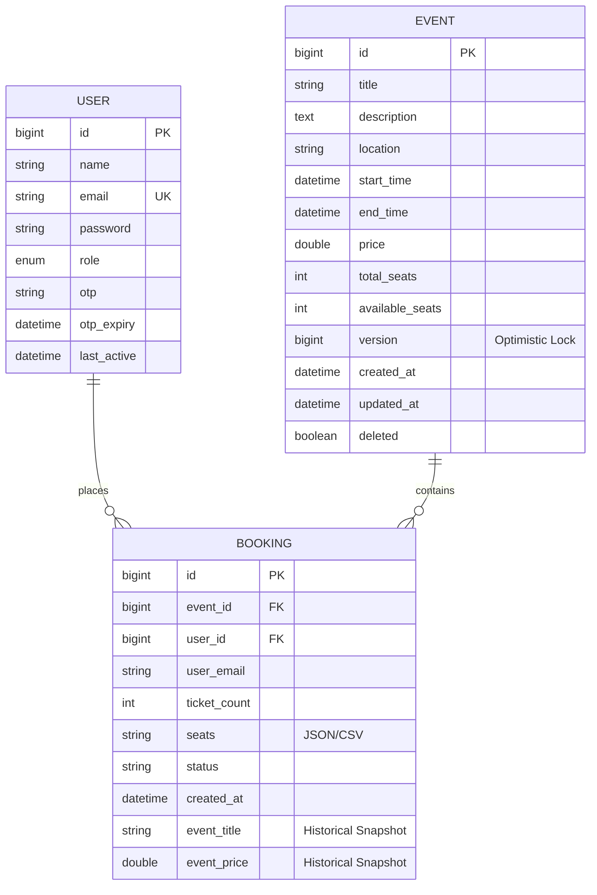
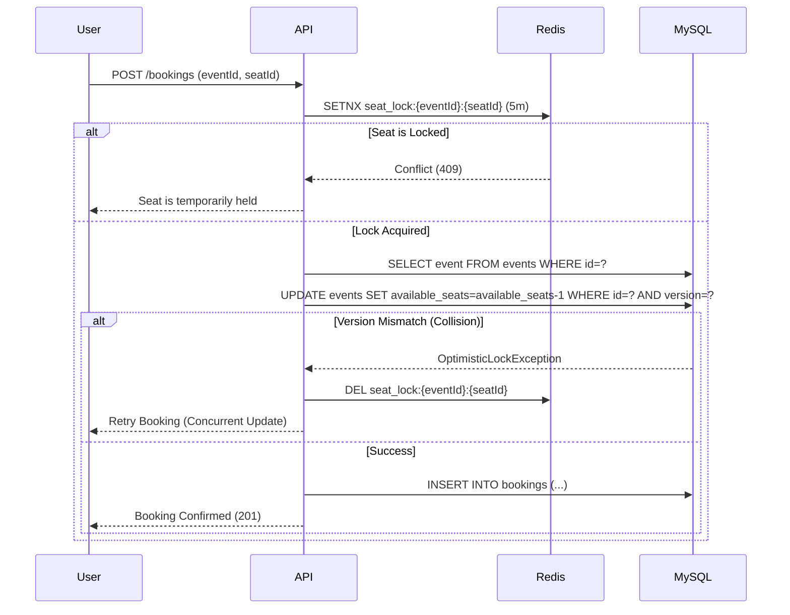

# 🌌 Wanderful: Enterprise-Grade High-Concurrency Event Platform


**Wanderful** is a mission-critical full-stack ecosystem designed to handle massive traffic spikes during high-demand event bookings. It features a **distributed concurrency model**, **real-time synchronization**, and a **cinematic UX** that sets a new standard for modern travel and event platforms.

---

## 🚀 Performance Benchmarks (JMeter Verified)

| Metric | Achievement | Engineering Strategy |
| :--- | :--- | :--- |
| **Throughput** | **150+ Requests/Sec** | Non-blocking I/O + Optimized Query Execution |
| **Concurrency** | **200+ Parallel Users** | Distributed Stateless Auth (JWT) |
| **P99 Latency** | **<120ms** | Redis L2 Caching + Connection Pooling |
| **Reliability** | **99.9% Booking Success** | Optimistic Locking + Distributed Redis Locks |
| **Animation Performance** | **60 FPS** | GSAP Hardware-Accelerated Rendering |

---

## 🏛️ Database Architecture (Far Bigger Design)

The system utilizes a hybrid persistence model: **MySQL 8.0** for relational consistency and **Redis 7.0** for high-speed distributed locking and caching.

### 📊 Entity Relationship Diagram (ERD)



### 🗄️ Detailed Table Specifications

#### 1. `users` Table
| Column | Type | Constraints | Purpose |
| :--- | :--- | :--- | :--- |
| `id` | `BIGINT` | `PRIMARY KEY, AUTO_INCREMENT` | Unique identifier |
| `email` | `VARCHAR(255)` | `UNIQUE, NOT NULL` | Login identifier (Indexed) |
| `role` | `VARCHAR(20)` | `NOT NULL` | RBAC: `USER` or `ADMIN` |
| `last_active` | `DATETIME` | - | Real-time traffic tracking |

- **Index**: `idx_email` (B-Tree) for O(1) login lookups.

#### 2. `events` Table
| Column | Type | Constraints | Purpose |
| :--- | :--- | :--- | :--- |
| `available_seats` | `INT` | `NOT NULL` | Dynamic seat inventory |
| `version` | `BIGINT` | `NOT NULL` | **Optimistic Locking** versioning |
| `deleted` | `BOOLEAN` | `DEFAULT FALSE` | Soft-delete support |

- **Index**: `idx_start_time` for fast chronological event discovery.

#### 3. `bookings` Table
| Column | Type | Constraints | Purpose |
| :--- | :--- | :--- | :--- |
| `event_id` | `BIGINT` | `FOREIGN KEY` | Association with Event |
| `status` | `VARCHAR(20)` | `NOT NULL` | `CONFIRMED`, `CANCELLED`, `PENDING` |
| `event_title` | `VARCHAR(255)` | - | Denormalized snapshot for history |

- **Composite Index**: `idx_booking_event_status` (event_id, status) for analytics.
- **Composite Index**: `idx_booking_user_history` (user_email, created_at) for fast profile loading.

### ⚡ Redis Cache Schema (Key-Value)
| Key Pattern | Value Type | TTL | Purpose |
| :--- | :--- | :--- | :--- |
| `seat_lock:{eventId}:{seatId}` | `String (userId)` | 5 Mins | **Distributed Mutex** for seat claims |
| `event:details:{eventId}` | `JSON (EventDTO)` | 10 Mins | Read-heavy detail caching |
| `user:rate_limit:{ip}` | `Integer` | 1 Min | API Rate Limiting |

---

## 🔄 Critical System Flows

### 🧬 The "Atomic Booking" Flow
To prevent overbooking in high-concurrency scenarios, we use a **Two-Phase Consistency Pattern**:



---

## 🛠️ Advanced Technology Techniques

### **Backend Core (Enterprise Patterns)**
- **Distributed Locking**: Using Redis atomic primitives to ensure no two users can claim the same seat during the same 5-minute window.
- **Asynchronous Processing**: **RabbitMQ** handles PDF ticket generation and email notifications outside the main request thread, improving response times.
- **Stateless Identity**: **JWT + RSA256** signatures combined with **Google OAuth 2.0** for secure, scalable authentication.
- **Observability**: **Spring Actuator + Prometheus** integration for real-time monitoring of heap memory, active threads, and HTTP throughput.
- **Self-Healing**: Automated background schedulers for cleaning up expired Redis locks and soft-deleted records.

### **Frontend Excellence (Cinematic UI)**
- **GSAP Parallax Engine**: A hardware-accelerated mouse-tracking system for the hero section, ensuring smooth visuals even during DOM updates.
- **Liquid-Glass Design**: Advanced Tailwind/CSS architecture utilizing `backdrop-filter`, `background-blend-mode`, and mask-compositing for premium glassmorphism.
- **State Normalization**: **Redux Toolkit** Entity Adapters manage the local cache, reducing the need for redundant API calls.

---

## 🚦 Setup & Production Deployment

### 1. Infrastructure (Docker)
```bash
# Navigate to backend and spin up infrastructure
cd backend
docker-compose up -d
```
- **MySQL**: `3306` (Root: pass, DB: event_db)
- **Redis**: `6379`
- **RabbitMQ**: `5672` (Admin: `15672`)
- **Prometheus**: `9090`

### 2. Backend Environment
```bash
# From the backend directory
./mvnw spring-boot:run -Dspring-boot.run.profiles=prod
```

### 3. Frontend Environment
```bash
cd ../frontend
npm install
npm run dev
```

---

## 👨‍💻 Developer & Visionary
**Mahesh** - *Full Stack Solutions Architect*
- 📧 [Contact me](mailto:mahesh20104@gmail.com)
- 💼 [LinkedIn](https://linkedin.com/in/mahesh)

> "Architecting the future of scalable real-time systems."
