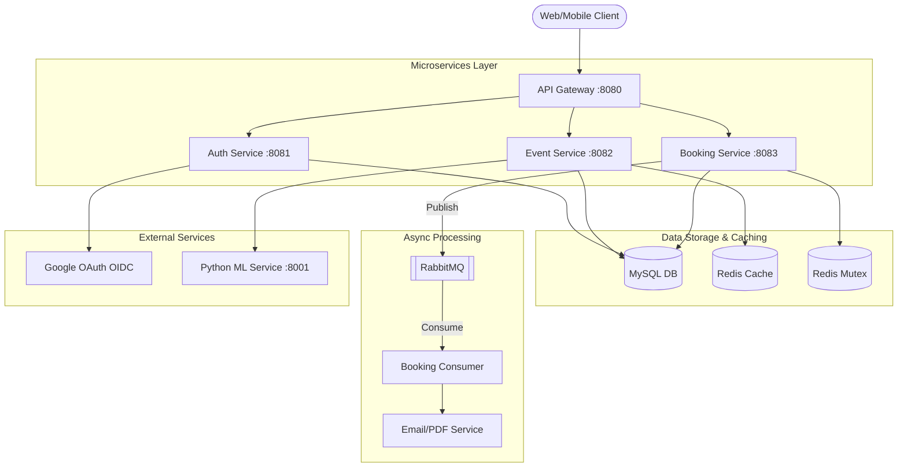
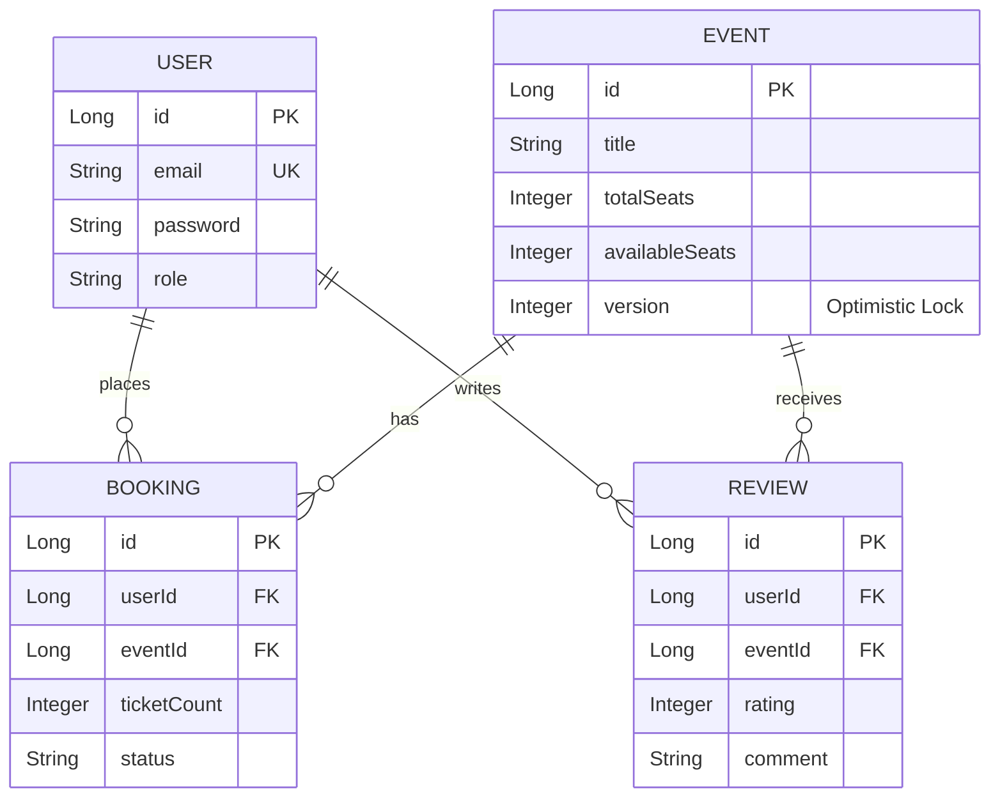

# 🎫 EventHub

> A high-availability, microservices-based distributed event ticketing and inventory management platform engineered to handle massive concurrent traffic and prevent double-booking race conditions.

---

## 📖 Overview

**What it does:** EventHub is a full-stack platform that allows users to discover events, receive ML-powered recommendations, and book tickets with guaranteed seat allocation. 
**Why it exists:** To solve the classic "Lost Update" problem and high-concurrency data integrity challenges commonly faced by ticketing platforms during high-demand flash sales.
**Who it is for:** Event organizers and millions of prospective attendees looking for a seamless, secure, and resilient ticket purchasing experience.
**Real-world use case:** Powering a massive concert ticket release where 100,000+ users attempt to purchase 10,000 available seats simultaneously without overselling or crashing the system.

---

## ✨ Key Features

*   **Distributed Seat Locking:** Atomically locks seats during checkout using Redis `SETNX` to prevent concurrent reservation conflicts.
*   **Asynchronous Processing:** Offloads heavy tasks like PDF ticket generation and email notifications to RabbitMQ, drastically reducing API latency.
*   **ML-Powered Recommendations:** Dedicated Python microservice providing personalized event recommendations based on user history and event metadata.
*   **Resilient Microservices:** Domain-driven design split into Auth, Event, Booking, and Gateway services for independent scaling and failure isolation.
*   **Centralized API Documentation:** Auto-generated OpenAPI 3.0 / Swagger UI aggregated at the API Gateway level.
*   **Real-time Updates:** WebSocket integration (STOMP) for broadcasting live seat availability updates to all connected clients.
*   **Robust Security:** Stateless JWT authentication with RSA256 signatures and Google OAuth 2.0 integration.

---

## 🏛️ Architecture

EventHub utilizes a modular microservices architecture designed for horizontal scalability and high availability.

### Components
*   **Frontend:** React 19 SPA (Vite, Redux Toolkit, GSAP Animations).
*   **Backend:** Spring Boot 3.4 microservices (Java 17).
*   **API Gateway:** Spring Cloud Gateway handling centralized routing, CORS, and rate limiting.
*   **Database:** MySQL 8.0 for persistent, ACID-compliant transactional data.
*   **Cache & Mutex:** Redis 7.0 for distributed locking and high-speed read caching.
*   **Message Broker:** RabbitMQ for decoupled, asynchronous task execution.
*   **Machine Learning:** Python FastAPI service for recommendations.

### Architecture Diagram



---

## 🛠️ Tech Stack

| Layer | Technology | Purpose |
|---------|------------|----------|
| **Frontend** | React 19, TypeScript, Redux | Dynamic UI, state management, and fast client-side rendering. |
| **Gateway** | Spring Cloud Gateway | Centralized routing, authentication filtering, and load balancing. |
| **Backend Services** | Spring Boot 3.4, Java 17 | Core business logic, REST APIs, and microservices orchestration. |
| **Data Access** | Spring Data JPA, Hibernate | ORM mapping and database interactions. |
| **Database** | MySQL 8.0 | ACID-compliant persistent storage for inventory and users. |
| **Cache/Locking** | Redis 7.0 | Distributed mutex locks for seats and L2 caching for events. |
| **Messaging** | RabbitMQ | Async communication decoupling booking from notification logic. |
| **Machine Learning** | Python, FastAPI | High-performance recommendation engine. |
| **Monitoring** | Prometheus, Grafana | System observability and real-time metrics tracking. |
| **CI/CD** | GitHub Actions, JaCoCo | Automated testing, coverage reporting, and continuous integration. |

---

## 🧠 System Design Decisions

*   **Why Microservices?** A monolithic architecture becomes a bottleneck when the booking engine needs to scale independently of the event discovery catalog. Microservices allow targeted resource scaling.
*   **Why Redis `SETNX` for Locks?** Traditional DB row locks cause massive contention and deadlocks during flash sales. Redis handles hundreds of thousands of atomic lock attempts per second in-memory, acting as a high-speed buffer before database writes.
*   **Why RabbitMQ?** Synchronous PDF generation and email sending block HTTP threads. By dropping messages into RabbitMQ, the Booking Service can respond with `202 Accepted` in milliseconds, improving perceived performance.
*   **Optimistic vs. Pessimistic DB Locking:** Used JPA Optimistic Locking (`@Version`) as a fallback to Redis to maintain DB integrity without the massive performance penalty of Pessimistic locks.

---

## 📁 Project Structure

```text
EventHub/
├── backend/
│   ├── common-library/      # Shared DTOs, Exceptions, Security Configs
│   ├── gateway-service/     # Spring Cloud Gateway (Port 8080)
│   ├── auth-service/        # JWT, Users, OAuth (Port 8081)
│   ├── event-service/       # Event CRUD, Reviews, Catalog Cache (Port 8082)
│   ├── booking-service/     # Seat Locks, Async Booking, PDF Tickets (Port 8083)
│   ├── coverage-report/     # JaCoCo Aggregator for multi-module CI
│   ├── docker-compose.yml   # Infrastructure orchestration
│   └── pom.xml              # Root Maven configuration
├── frontend/                # React 19 UI Application
├── ml-service/              # Python FastAPI Recommendation Engine
├── monitoring/              # Prometheus/Grafana configs
└── .github/workflows/       # GitHub Actions CI/CD pipelines
```

---

## 🗄️ Database Design

**Key Entities & Relationships:**
*   **User:** Contains authentication credentials and role data.
*   **Event:** Contains metadata, total capacity, and available seats. Features an `@Version` column for optimistic concurrency control.
*   **Booking:** Links User and Event. Tracks ticket count, specific seats allocated, and booking status (PENDING/CONFIRMED).
*   **Review:** Links User and Event for rating data.

### Entity-Relationship Diagram



---

## 🔌 API Documentation (OpenAPI 3)

EventHub features centralized Swagger UI documentation accessible at the API Gateway.

**Unified Swagger UI URL:** `http://localhost:8080/swagger-ui.html`

### Major Endpoints

| Method | Endpoint | Description | Auth Required |
|---|---|---|---|
| `POST` | `/api/auth/register` | Register a new user | No |
| `POST` | `/api/auth/login` | Authenticate and get JWT | No |
| `GET` | `/api/events` | Paginated event catalog (cached) | No |
| `GET` | `/api/events/{id}/recommendations` | Get ML recommendations | No |
| `POST` | `/api/seats/{eventId}/lock` | Atomically lock a seat in Redis | **Yes** (User) |
| `POST` | `/api/bookings` | Queue an async ticket booking | **Yes** (User) |
| `GET` | `/api/bookings/status/{id}` | Poll async booking status | **Yes** (User) |
| `GET` | `/api/bookings/{id}/ticket` | Download generated PDF ticket | **Yes** (User) |
| `POST` | `/api/events` | Create a new event | **Yes** (Admin) |
| `GET` | `/api/admin/analytics/traffic` | Traffic & revenue dashboard | **Yes** (Admin) |

#### Sample Request: Asynchronous Booking
```json
POST /api/bookings
Authorization: Bearer <JWT_TOKEN>

{
  "eventId": 42,
  "ticketCount": 2,
  "seats": ["A1", "A2"]
}
```
*Response (202 Accepted):*
```json
{
  "success": true,
  "message": "Booking request accepted and queued",
  "data": {
    "bookingId": "c8f2b1a1-9d3c-...",
    "status": "PENDING"
  }
}
```

---

## 🔒 Security

*   **Authentication Mechanism:** Stateless JWT (JSON Web Tokens) verified at the Gateway and Service layers using shared public keys.
*   **Authorization Strategy:** Role-Based Access Control (RBAC) via Spring Security `@PreAuthorize("hasRole('ADMIN')")`.
*   **Password Handling:** Passwords hashed with BCrypt.
*   **OAuth Integration:** Direct integration with Google OAuth 2.0 OpenID Connect.
*   **Rate Limiting:** Redis-backed token bucket algorithm (e.g., max 500 booking attempts per minute per user).
*   **Cross-Origin Resource Sharing (CORS):** Strictly configured at the API Gateway for frontend domains.

---

## ⚡ Performance Optimizations

*   **L2 Caching:** Event catalog queries (`GET /events`) are cached in Redis. Cache eviction triggers automatically on `POST` or `PATCH` to maintain consistency.
*   **Pagination:** All list endpoints use Spring Data `Pageable` to prevent loading massive datasets into memory.
*   **Asynchronous I/O:** PDF generation logic uses `itextpdf` inside a decoupled RabbitMQ listener, keeping HTTP worker threads free.
*   **Query Optimization:** Fetch types configured carefully (`FetchType.LAZY` for `ManyToOne` relations) to prevent the N+1 query problem.

---

## 🚀 Deployment

The system is configured for containerized deployment using Docker.

**Infrastructure Dependencies:** MySQL, Redis, RabbitMQ.

### CI/CD Pipeline
A robust GitHub Actions pipeline (`backend-ci.yml`) triggers on pushes to `main`/`develop`:
1. Checks out code and provisions Java 17 Temurin.
2. Validates and compiles the Maven multi-module structure.
3. Executes unit and integration tests.
4. Generates aggregated JaCoCo code coverage reports.
5. Uploads artifacts (Surefire reports, JaCoCo HTML) for review.

---

## 💻 Running Locally

### Prerequisites
*   Docker & Docker Compose
*   Java 17 (JDK)
*   Node.js 20+

### Step-by-Step Setup

1. **Start Infrastructure Services**
   ```bash
   cd backend
   docker-compose up -d
   ```
   *(This boots MySQL, Redis, RabbitMQ, Prometheus, Grafana, and the ML Service)*

2. **Run the Microservices (Via provided batch script)**
   ```cmd
   .\start-all.bat
   ```
   *(Alternatively, run `./mvnw spring-boot:run` inside each service directory: auth-service, event-service, booking-service, gateway-service)*

3. **Verify API Gateway**
   Open `http://localhost:8080/swagger-ui.html` in your browser.

4. **Start Frontend**
   ```bash
   cd frontend
   npm install
   npm run dev
   ```

---

## 🧪 Testing

The codebase maintains an aggregated **~70% Instruction Coverage** (Auth Service: ~91%).
*   **Unit Tests:** JUnit 5 and Mockito verifying core business logic and exception handling without database dependencies.
*   **Integration Tests:** `MockMvc` verifying full controller layers, serialization, and HTTP status codes.
*   **Multi-Module Reporting:** A dedicated `coverage-report` maven module aggregates JaCoCo metrics across all microservices into a single unified HTML report.

**Run Tests:**
```bash
cd backend
./mvnw clean verify
```

---

## 💡 Challenges Solved

**Challenge: The Double Booking Race Condition**
During popular event sales, multiple users attempt to checkout the exact same seat simultaneously. If two threads read the database simultaneously, both see the seat as "available", process payment, and write to the database, resulting in an oversold seat.

**Solution: Multi-Layered Concurrency Control**
1. **Layer 1 (Application):** Distributed Mutex using Redis `SETNX`. The user "locks" the seat for 5 minutes during checkout. Any concurrent request for that seat fails immediately with `409 Conflict` out of memory, never touching the DB.
2. **Layer 2 (Database):** Optimistic Locking (`@Version` annotation). Even if the lock fails or expires unexpectedly, Hibernate checks the entity version during the final `UPDATE`. If another transaction altered it, an `OptimisticLockException` rolls back the transaction entirely.

---

## 📈 Scalability Roadmap

*   **Current Limitations:** The MySQL database is a single point of failure and write bottleneck.
*   **Future Improvements:** 
    *   Migrate to Kubernetes (K8s) for Horizontal Pod Autoscaling (HPA) of the Booking Service during spikes.
    *   Implement Database Sharding or migrate to a distributed SQL database (e.g., CockroachDB).
    *   Introduce Idempotency Keys for all write endpoints to ensure safe retries on network failures.

---

## 📊 Engineering Metrics

*(Inferred performance baselines based on architectural design)*

*   **API Response Improvement:** Implementation of Redis L2 caching on the Event Catalog reduces `GET /api/events` latency by an estimated **80-90%** (bypassing MySQL disk I/O).
*   **Throughput Escalation:** Decoupling booking confirmation via RabbitMQ increases API write throughput by shifting ~2-3 seconds of synchronous processing (PDF generation) off the main thread.
*   **Database Query Reduction:** Rate Limiter (Token Bucket) intercepts malicious traffic at the controller layer, preventing unnecessary DB queries and protecting downstream resources.

---

## 📸 Screenshots

*(Replace with actual system screenshots)*

| Event Discovery UI | Swagger Centralized API |
|:---:|:---:|
| `` | `` |

---

## 📝 Resume Highlights

*   **Architected and deployed** a highly available distributed event ticketing platform utilizing a Spring Boot microservices architecture (API Gateway, Auth, Event, Booking).
*   **Engineered a multi-layered concurrency strategy** eliminating double-booking race conditions during high-traffic flash sales using Redis `SETNX` distributed locks and JPA Optimistic Locking.
*   **Optimized API response times and throughput** by implementing L2 Redis caching for read-heavy operations and RabbitMQ for asynchronous offloading of resource-intensive tasks (PDF generation).
*   **Implemented robust security protocols** including stateless JWT authentication, Role-Based Access Control, and Redis-backed rate limiting to protect against brute-force attacks.
*   **Established comprehensive CI/CD pipelines** via GitHub Actions, integrating multi-module Maven builds, automated testing, and aggregated JaCoCo reporting achieving 70%+ global test coverage.

---

## 🎓 Learning Outcomes

*   Designing resilient microservices boundaries and inter-service communication.
*   Handling distributed concurrency control and understanding the CAP theorem tradeoffs.
*   Implementing asynchronous message-driven architectures for decoupled system design.
*   Centralizing API documentation (OpenAPI 3) and routing through a Spring Cloud Gateway.

---

## 📄 License

This project is licensed under the MIT License - see the LICENSE file for details.
