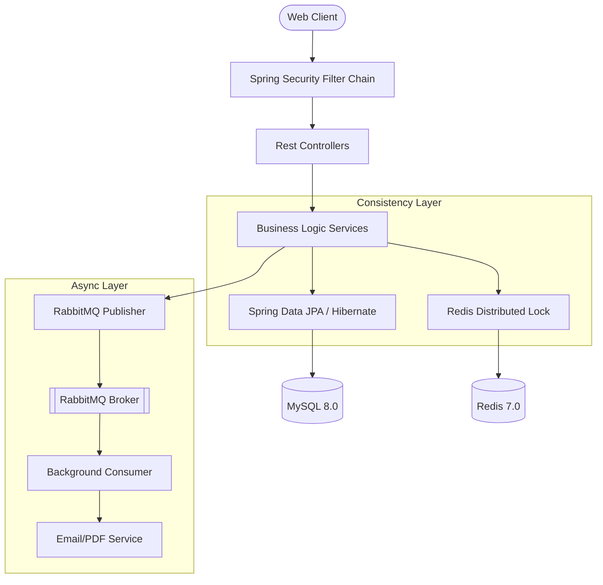

# 🌌 EventHub: Distributed Event Booking Platform

[](https://spring.io/projects/spring-boot)
[](https://reactjs.org/)
[](https://redis.io/)
[](https://www.rabbitmq.com/)

## 1. Project Overview
EventHub is a full-stack platform designed for high-availability event ticketing and inventory management. The system addresses the technical challenges of maintaining data consistency during high-contention booking windows through a multi-layered concurrency strategy.

### Primary Use Cases
*   **Inventory Reservation**: Synchronized seat selection across concurrent users.
*   **Transactional Booking**: Atomic ticket issuance with integrated payment simulation.
*   **Background Processing**: Offloading resource-intensive tasks (PDF generation, notifications) to message brokers.

---

## 2. System Features

| Category | Technical Implementation |
| :--- | :--- |
| **Identity & Access** | Stateless JWT with RSA256 signatures; Google OAuth 2.0 OpenID Connect. |
| **Concurrency Control** | Distributed Mutex (Redis SETNX) + JPA Optimistic Locking (`@Version`). |
| **Data Integrity** | Transactional boundaries for inventory updates; soft-deletes for audit trails. |
| **Async Operations** | RabbitMQ-driven task offloading for PDF generation and email delivery. |
| **Observability** | Prometheus-compatible metrics via Spring Actuator and Micrometer. |
| **Performance** | Redis L2 caching for read-heavy event metadata. |

---

## 3. Architecture & Data Flow

### 3.1 Backend Service Architecture
The backend follows a modular monolith structure, separating concerns into domain-specific packages.



### 3.2 Request Lifecycle: Booking Flow
1.  **Auth**: Filter chain validates JWT/OAuth principal.
2.  **Inventory Check**: Initial read from MySQL (or Redis cache).
3.  **Distributed Lock**: Attempt `SETNX` on `seat_lock:{eventId}:{seatId}`.
4.  **Transaction**:
    *   Update event capacity.
    *   Hibernate checks `@Version` for stale reads.
    *   Save booking record.
5.  **Event Dispatch**: Publish `BookingMessage` to RabbitMQ.
6.  **Cleanup**: Release Redis lock (explicitly or via 5m TTL).

---

## 4. Concurrency & Integrity Strategy

### 4.1 Distributed Locking (Redis SETNX)
To prevent the "Lost Update" problem at the application layer, we implement a distributed mutex.
*   **Strategy**: `setIfAbsent(key, value, timeout)`
*   **Failure Behavior**: Returns `409 Conflict` if the lock is held.
*   **Expiration**: 5-minute TTL prevents deadlocks from orphaned locks.

### 4.2 Optimistic Locking (JPA `@Version`)
Serves as a second layer of defense for database consistency.
*   **Implementation**: Every `Event` entity has a version field incremented on update.
*   **Conflict Handling**: If two transactions pass the Redis lock but update simultaneously, the second will throw `OptimisticLockException`.

---

## 5. API Documentation (OpenAPI 3 / Swagger UI)

EventHub exposes full, interactive **OpenAPI 3.0** documentation powered by `springdoc-openapi`.

### 5.1 Swagger UI Access

| Service | Swagger UI URL | Raw OpenAPI JSON |
| :--- | :--- | :--- |
| **Gateway (Aggregated)** | `http://localhost:8080/swagger-ui.html` | N/A (aggregator only) |
| **Auth Service** | `http://localhost:8081/api/swagger-ui.html` | `http://localhost:8081/api/v3/api-docs` |
| **Event Service** | `http://localhost:8082/api/swagger-ui.html` | `http://localhost:8082/api/v3/api-docs` |
| **Booking Service** | `http://localhost:8083/api/swagger-ui.html` | `http://localhost:8083/api/v3/api-docs` |

> **Recommended**: Use the Gateway Swagger UI (`localhost:8080/swagger-ui.html`). It provides a unified dropdown to switch between all API groups.

### 5.2 API Groups

| Group | Tag | Description |
| :--- | :--- | :--- |
| **Auth APIs** | `Authentication APIs` | Register, Login, Google OAuth, OTP Verification, Password Reset |
| **Event APIs** | `Event APIs` | Create, Read, Update, Delete events; ML Recommendations |
| **Review APIs** | `Review APIs` | Submit and view event reviews |
| **Booking APIs** | `Booking APIs` | Create bookings (async), poll status, download PDF tickets |
| **Seat Lock APIs** | `Seat Lock APIs` | Distributed Redis seat locking (HTTP + WebSocket) |
| **Analytics APIs** | `Analytics APIs` | Admin-only: traffic dashboard, revenue breakdown |

### 5.3 Documented Endpoints Summary

| Method | Path | Description |
| :--- | :--- | :--- |
| `POST` | `/api/auth/register` | Create user account |
| `POST` | `/api/auth/login` | Authenticate with email/password |
| `POST` | `/api/auth/verify-otp` | 2FA OTP verification |
| `POST` | `/api/auth/google` | Google OAuth login |
| `POST` | `/api/auth/forgot-password` | Request password reset OTP |
| `POST` | `/api/auth/reset-password` | Reset password with OTP |
| `GET` | `/api/events` | Paginated list of upcoming events |
| `GET` | `/api/events/{id}` | Get event details |
| `POST` | `/api/events` | Create event (ADMIN) |
| `PATCH` | `/api/events/{id}` | Update event (ADMIN) |
| `DELETE` | `/api/events/{id}` | Delete event (ADMIN) |
| `GET` | `/api/events/{id}/recommendations` | ML-powered recommendations |
| `POST` | `/api/events/{id}/reviews` | Submit review |
| `GET` | `/api/events/{id}/reviews` | Get event reviews |
| `POST` | `/api/bookings` | Initiate async booking |
| `GET` | `/api/bookings/status/{id}` | Poll booking status |
| `GET` | `/api/bookings` | My bookings (paginated) |
| `GET` | `/api/bookings/{id}/ticket` | Download PDF ticket |
| `POST` | `/api/seats/{eventId}/lock` | Lock a seat |
| `POST` | `/api/seats/{eventId}/unlock` | Unlock a seat |
| `GET` | `/api/seats/{eventId}/locked` | Get all locked seats |
| `GET` | `/api/admin/analytics/traffic` | Traffic dashboard (ADMIN) |
| `GET` | `/api/admin/analytics/revenue` | Revenue by event (ADMIN) |

### 5.4 Authentication in Swagger UI
1. Open the Swagger UI URL above.
2. Click the **Authorize 🔒** button.
3. Enter your JWT token from the login response (without the `Bearer ` prefix).
4. Click **Authorize**, then **Close**.
5. All subsequent API calls will include the `Authorization: Bearer <token>` header.

---

## 6. Tech Stack Details

| Layer | Component | Implementation |
| :--- | :--- | :--- |
| **Frontend** | React 19, TS | Vite build tool; Redux Toolkit for state management. |
| **Backend** | Spring Boot 3.4 | Spring Web, Security, Data JPA, Actuator. |
| **Persistence** | MySQL 8.0 | InnoDB engine; normalized schema for referential integrity. |
| **Messaging** | RabbitMQ | Decoupled background task execution. |
| **In-Memory** | Redis 7.0 | Caching and distributed synchronization. |

---

## 7. Development & Deployment

### 7.1 Local Environment Setup
1.  **Infrastructure**: Navigate to `backend/` and run `docker-compose up -d` to spin up MySQL, Redis, and RabbitMQ.
2.  **Backend**: `./mvnw spring-boot:run`.
3.  **Frontend**: `npm install && npm run dev`.

### 7.2 Deployment Strategy
*   **Current State**: Deployable via Docker Compose for all infrastructure.
*   **Future Roadmap**:
    *   Moving to Kubernetes (K8s) for horizontal pod autoscaling (HPA).
    *   Implementing Idempotency Keys for all write operations.
    *   Migrating to a distributed database (e.g., CockroachDB) if relational scaling becomes a bottleneck.

---

## 5. Detailed Documentation
For deep-dives into specific modules, refer to the technical docs:
*   [**Concurrency & Locking Strategy**](docs/concurrency/locking-strategy.md)
*   [**Backend Architecture & Data Flow**](docs/architecture/system-design.md)
*   [**API Specification**](docs/api/endpoints.md)
*   [**Deployment Roadmap**](docs/deployment/)

---

## 6. Folder Structure

```text
.
├── backend/                # Spring Boot Service
│   ├── src/main/java/      # Domain logic (auth, booking, events)
│   ├── src/main/resources/ # Persistence and environment config
│   └── docker-compose.yml  # Local infrastructure definition
├── frontend/               # React SPA
│   ├── src/components/     # UI components (GSAP integration)
│   ├── src/store/          # Redux/State management
│   └── vite.config.ts      # Frontend build config
└── docs/                   # Conceptual documentation modules
```

---

## 9. Contributing & Security
*   **Security Architecture**: All sensitive operations require valid JWT. Rate limiting is applied at the IP level.
*   **Monitoring**: Access real-time metrics at `/actuator/prometheus`.

---
*For detailed implementation notes, refer to the source code documentation in the respective modules.*
