# 🎫 EventHub

**Live Demo:** [https://eventshublimited.netlify.app/](https://eventshublimited.netlify.app/)

[](https://github.com/Mahesh5f4/event-management-system/actions/workflows/backend-ci.yml)
[](https://openjdk.org/projects/jdk/17/)
[](https://spring.io/projects/spring-boot)
[](https://spring.io/projects/spring-cloud)
[](./backend/docker-compose.yml)
[](./ml-service)
[](./backend/coverage-report)
[](./LICENSE)
[](./docs/AWS_DEPLOYMENT_GUIDE.md)

> A high-availability, microservices-based distributed event ticketing and inventory management platform engineered to handle massive concurrent traffic and prevent double-booking race conditions.

---

## 📖 Overview

**What it does:** EventHub is a full-stack platform that allows users to discover events, receive ML-powered recommendations, and book tickets with guaranteed seat allocation. 
**Why it exists:** To solve the classic "Lost Update" problem and high-concurrency data integrity challenges commonly faced by ticketing platforms during high-demand flash sales.
**Who it is for:** Event organizers and millions of prospective attendees looking for a seamless, secure, and resilient ticket purchasing experience.
**Real-world use case:** Powering a massive concert ticket release where 100,000+ users attempt to purchase 10,000 available seats simultaneously without overselling or crashing the system.

---

## ✨ Key Features

*   **Distributed Seat Locking:** Atomically locks seats during checkout using Redis `SETNX` to prevent concurrent reservation conflicts.
*   **Asynchronous Processing:** Offloads heavy tasks like PDF ticket generation and email notifications to RabbitMQ, drastically reducing API latency.
*   **ML-Powered Recommendations:** Dedicated Python microservice providing personalized event recommendations based on user history and event metadata.
*   **Resilient Microservices:** Domain-driven design split into Auth, Event, Booking, and Gateway services for independent scaling and failure isolation.
*   **Centralized API Documentation:** Auto-generated OpenAPI 3.0 / Swagger UI aggregated at the API Gateway level.
*   **Real-time Updates:** WebSocket integration (STOMP) for broadcasting live seat availability updates to all connected clients.
*   **Robust Security:** Stateless JWT authentication with RSA256 signatures and Google OAuth 2.0 integration.

---

## 🏛️ System Architecture & Microservice Communication

EventHub utilizes a modular microservices architecture designed for horizontal scalability, fault isolation, and high availability.

### Tech Stack Overview
*   **Frontend:** React 19 SPA (Vite, Redux Toolkit, GSAP Animations).
*   **Backend:** Spring Boot 3.4 microservices (Java 17).
*   **API Gateway:** Spring Cloud Gateway handling centralized routing, CORS, and rate limiting.
*   **Database:** MySQL 8.0 for persistent, ACID-compliant transactional data.
*   **Cache & Mutex:** Redis 7.4 for distributed locking and high-speed read caching.
*   **Message Broker:** RabbitMQ 3.13 for decoupled, asynchronous task execution.
*   **Machine Learning:** Python FastAPI service for recommendations.

---

### Overall System Architecture

This diagram details the flow of traffic, service routing, data components, and supporting services.

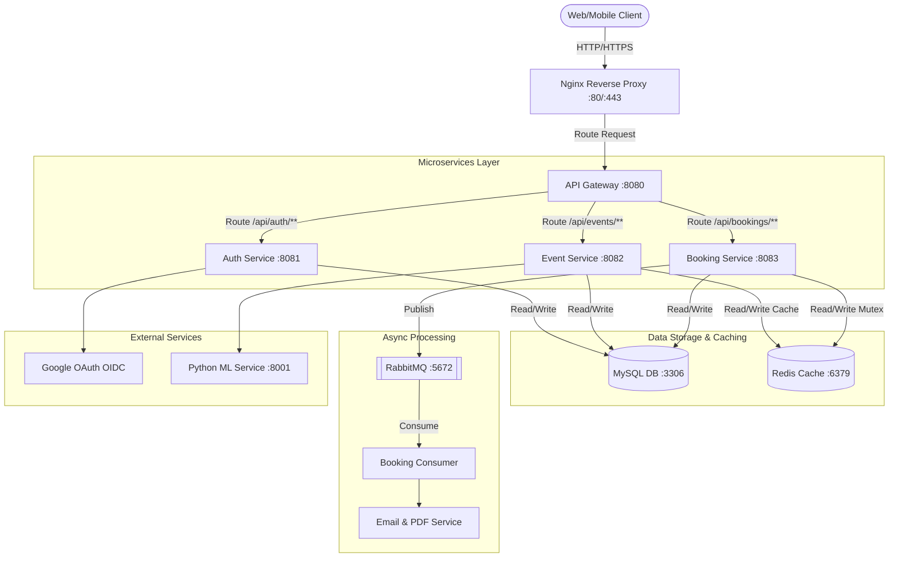

---

### Microservice Communication Topology

Illustrates how services communicate with one another: Synchronous REST calls (`RestTemplate`) for critical validations, Asynchronous Messaging (`RabbitMQ`) for tasks execution, and WebSockets (STOMP) for pushing real-time updates to clients.

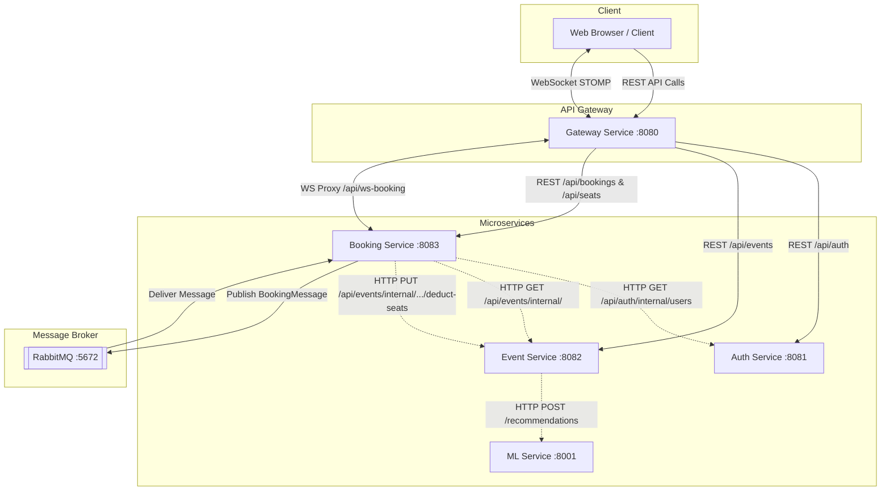

---

### API Request Lifecycle Flow

This sequence trace details the path an incoming API request takes from the client, through Nginx, the API Gateway, and down to the microservices.

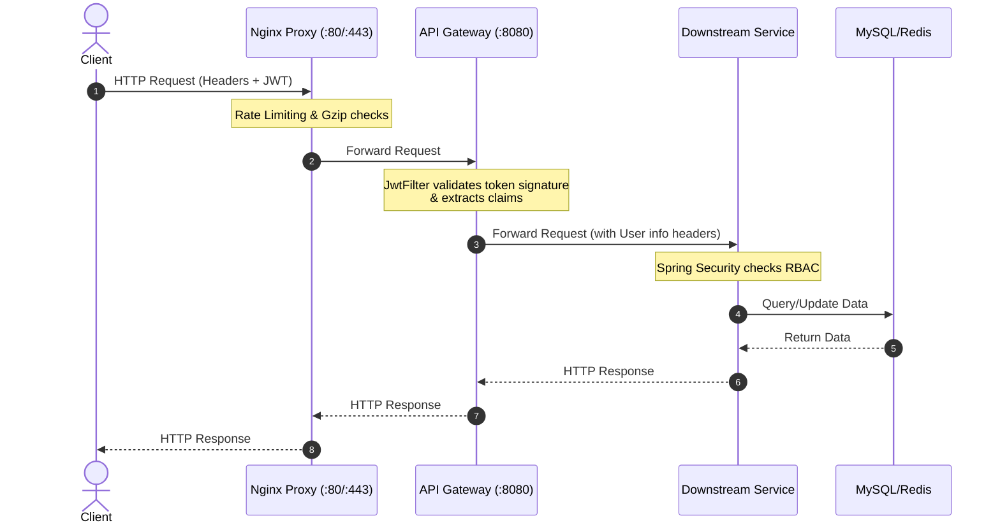

---

### Service Dependency Matrix

This diagram showcases both compile-time Maven build dependencies and run-time service linkages.

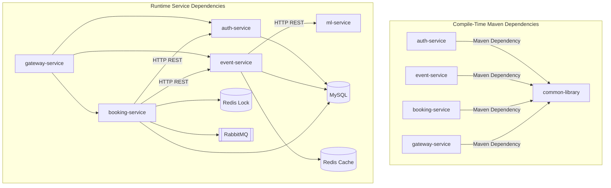

---

## 🧠 Internal Workings & Sequence Diagrams

---

### User Login & JWT Generation

This sequence details the credential validation and creation of stateless, cryptographically signed JWT tokens.

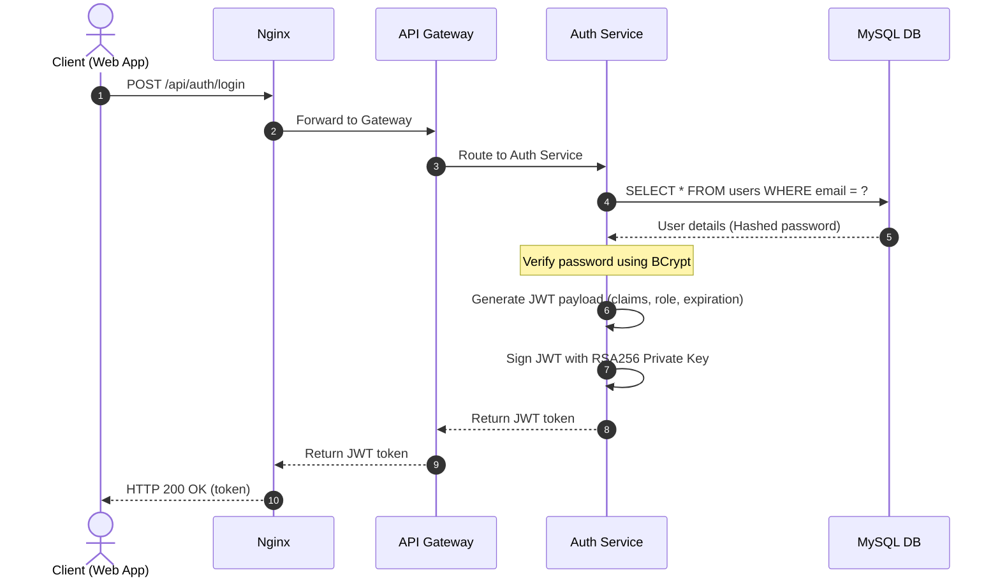

---

### JWT Authentication & Authorization Flow

Demonstrates validation of incoming authorization tokens by the Gateway without hitting the Authentication Database.

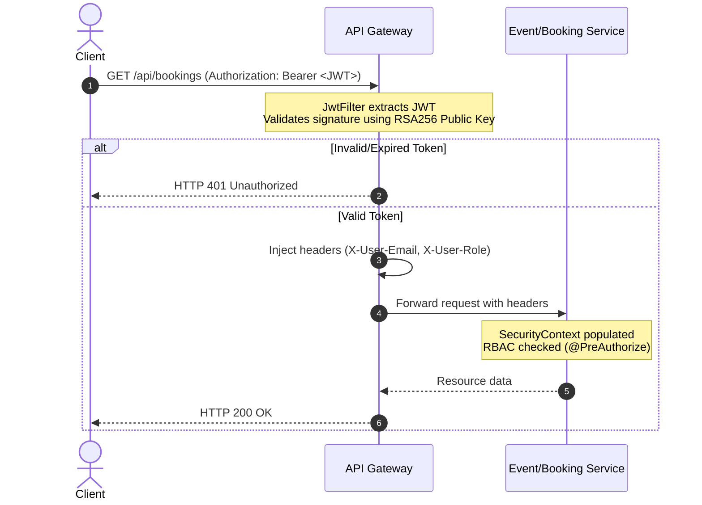

---

### Event Retrieval & Cache Read/Write Flow

Utilizes a cache-aside design with automatic expiration and eviction strategies.

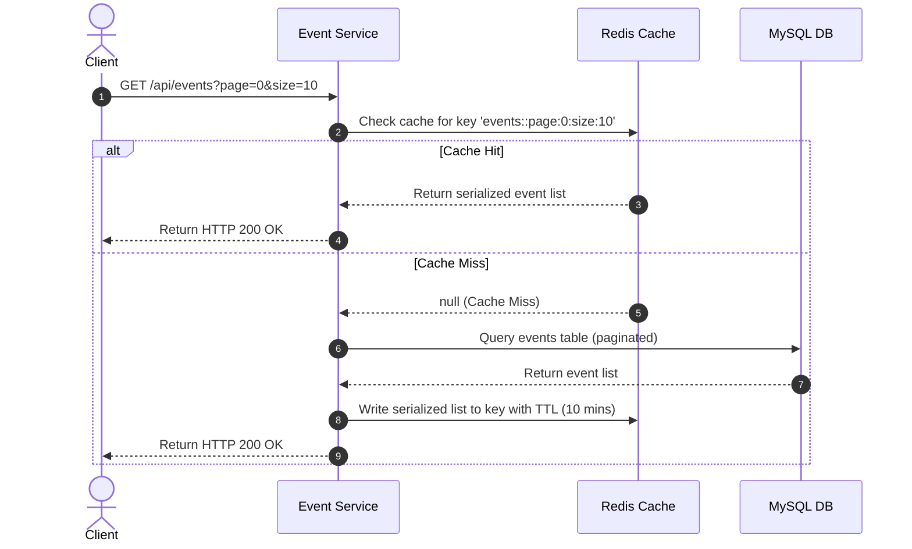

---

### Distributed Seat Locking & Seat Booking Checkout

Shows the interaction between distributed seat locking (Redis `SETNX`), optimistic version control in Hibernate, and the asynchronous ticket queueing workflow.

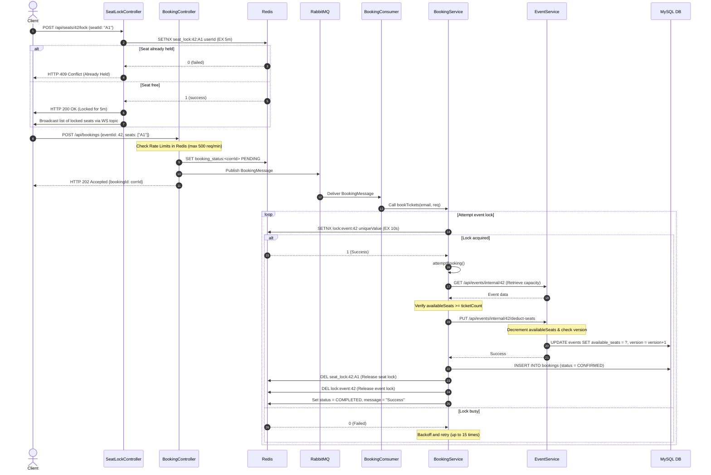

---

## 🛠️ Tech Stack

| Layer | Technology | Purpose |
|---------|------------|----------|
| **Frontend** | React 19, TypeScript, Redux | Dynamic UI, state management, and fast client-side rendering. |
| **Gateway** | Spring Cloud Gateway | Centralized routing, authentication filtering, and load balancing. |
| **Backend Services** | Spring Boot 3.4, Java 17 | Core business logic, REST APIs, and microservices orchestration. |
| **Data Access** | Spring Data JPA, Hibernate | ORM mapping and database interactions. |
| **Database** | MySQL 8.0 | ACID-compliant persistent storage for inventory and users. |
| **Cache/Locking** | Redis 7.4 | Distributed mutex locks for seats and L2 caching for events. |
| **Messaging** | RabbitMQ 3.13 | Async communication decoupling booking from notification logic. |
| **Machine Learning** | Python 3.12, FastAPI | High-performance recommendation engine. |
| **Monitoring** | Prometheus, Grafana | System observability and real-time metrics tracking. |
| **CI/CD** | GitHub Actions, JaCoCo | Automated testing, coverage reporting, and continuous integration. |

---

## 🧠 System Design Decisions

*   **Why Microservices?** A monolithic architecture becomes a bottleneck when the booking engine needs to scale independently of the event discovery catalog. Microservices allow targeted resource scaling.
*   **Why Redis `SETNX` for Locks?** Traditional DB row locks cause massive contention and deadlocks during flash sales. Redis handles hundreds of thousands of atomic lock attempts per second in-memory, acting as a high-speed buffer before database writes.
*   **Why RabbitMQ?** Synchronous PDF generation and email sending block HTTP threads. By dropping messages into RabbitMQ, the Booking Service can respond with `202 Accepted` in milliseconds, improving perceived performance.
*   **Optimistic vs. Pessimistic DB Locking:** Used JPA Optimistic Locking (`@Version`) as a fallback to Redis to maintain DB integrity without the massive performance penalty of Pessimistic locks.

---

## 📁 Project Structure

```text
EventHub/
├── backend/
│   ├── pom.xml                        # Root Maven POM (multi-module)
│   ├── docker-compose.yml             # Production orchestration (10 services)
│   ├── Makefile                       # Lifecycle commands (build/start/stop/backup...)
│   ├── .env.example                   # Environment variable template
│   ├── .env.production                # Production secrets (gitignored)
│   ├── .dockerignore                  # Excludes logs/IDE files from build context
│   │
│   ├── auth-service/                  # JWT · OAuth · Users  (Port 8081)
│   │   └── Dockerfile                 # Multi-stage: Maven build → JRE alpine
│   ├── event-service/                 # Events · Reviews · ML  (Port 8082)
│   │   └── Dockerfile                 # Multi-stage: Maven build → JRE alpine
│   ├── booking-service/               # Seats · Async Booking · PDF  (Port 8083)
│   │   └── Dockerfile                 # Multi-stage: Maven build → JRE alpine
│   ├── gateway-service/               # Spring Cloud Gateway  (Port 8080)
│   │   └── Dockerfile                 # Multi-stage: Maven build → JRE alpine
│   ├── common-library/                # Shared DTOs · Exceptions · Security
│   ├── coverage-report/               # JaCoCo multi-module aggregator
│   │
│   ├── nginx/                         # Reverse proxy (only public-facing service)
│   │   ├── nginx.conf                 # Base config: gzip · rate limiting · workers
│   │   └── conf.d/
│   │       ├── default.conf           # HTTP server block (active)
│   │       └── default-https.conf     # HTTPS template (activate after domain setup)
│   │
│   ├── monitoring/
│   │   └── prometheus/prometheus.yml  # Scrapes all 4 services by container name
│   │
│   ├── scripts/
│   │   ├── backup.sh                  # Manual mysqldump (keeps last 7)
│   │   ├── restore.sh                 # Restore with confirmation gate
│   │   └── auto-backup.sh             # Nightly cron backup (14-day retention)
│   │
│   └── init-letsencrypt.sh            # One-shot Let's Encrypt HTTPS setup
│
├── ml-service/                        # Python FastAPI Recommendation Engine
│   ├── Dockerfile                     # python:3.12-slim · non-root · healthcheck
│   ├── main.py                        # TF-IDF cosine similarity recommender
│   └── requirements.txt
│
├── frontend/                          # React 19 SPA (Vite · Redux · GSAP)
│
├── docs/
│   ├── AWS_DEPLOYMENT_GUIDE.md        # 11-step EC2 deployment walkthrough
│   └── DEPLOYMENT_CHECKLIST.md        # 10-phase post-deployment verification
│
└── .github/workflows/                 # GitHub Actions CI/CD pipelines
```

---

## 🗄️ Database Design

**Key Entities & Relationships:**
*   **User:** Contains authentication credentials and role data.
*   **Event:** Contains metadata, total capacity, and available seats. Features an `@Version` column for optimistic concurrency control.
*   **Booking:** Links User and Event. Tracks ticket count, specific seats allocated, and booking status (PENDING/CONFIRMED).
*   **Review:** Links User and Event for rating data.

### Entity-Relationship Diagram

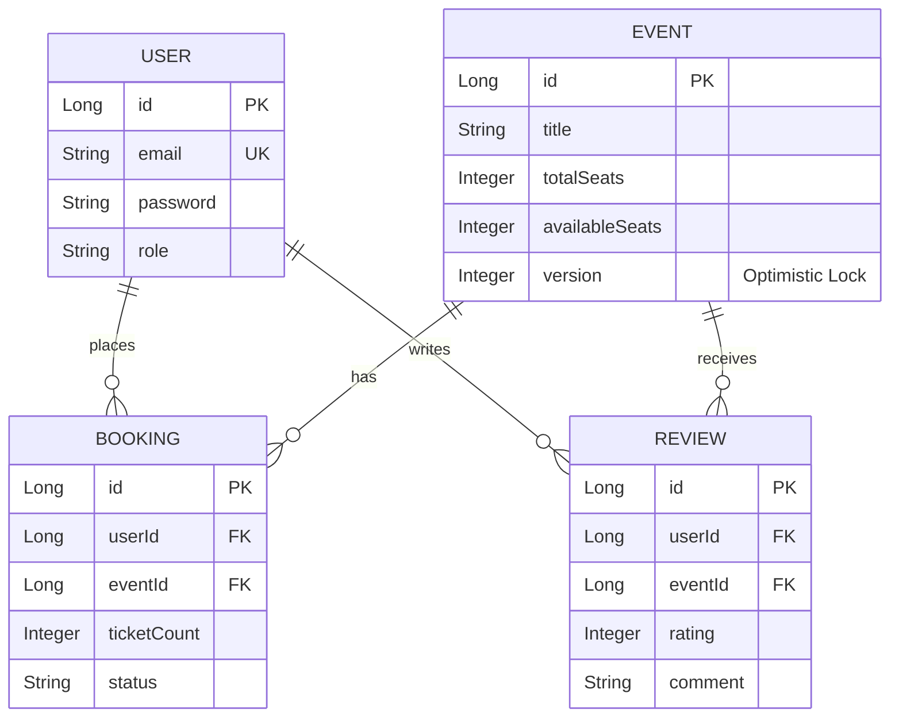

---

## 🔌 API Documentation (OpenAPI 3)

EventHub features centralized Swagger UI documentation accessible at the API Gateway.

**Unified Swagger UI URL:** `http://localhost:8080/swagger-ui.html`

### Major Endpoints

| Method | Endpoint | Description | Auth Required |
|---|---|---|---|
| `POST` | `/api/auth/register` | Register a new user | No |
| `POST` | `/api/auth/login` | Authenticate and get JWT | No |
| `GET` | `/api/events` | Paginated event catalog (cached) | No |
| `GET` | `/api/events/{id}/recommendations` | Get ML recommendations | No |
| `POST` | `/api/seats/{eventId}/lock` | Atomically lock a seat in Redis | **Yes** (User) |
| `POST` | `/api/bookings` | Queue an async ticket booking | **Yes** (User) |
| `GET` | `/api/bookings/status/{id}` | Poll async booking status | **Yes** (User) |
| `GET` | `/api/bookings/{id}/ticket` | Download generated PDF ticket | **Yes** (User) |
| `POST` | `/api/events` | Create a new event | **Yes** (Admin) |
| `GET` | `/api/admin/analytics/traffic` | Traffic & revenue dashboard | **Yes** (Admin) |

#### Sample Request: Asynchronous Booking
```json
POST /api/bookings
Authorization: Bearer <JWT_TOKEN>

{
  "eventId": 42,
  "ticketCount": 2,
  "seats": ["A1", "A2"]
}
```
*Response (202 Accepted):*
```json
{
  "success": true,
  "message": "Booking request accepted and queued",
  "data": {
    "bookingId": "c8f2b1a1-9d3c-...",
    "status": "PENDING"
  }
}
```

---

## 🔒 Security

*   **Authentication Mechanism:** Stateless JWT (JSON Web Tokens) verified at the Gateway and Service layers using shared public keys.
*   **Authorization Strategy:** Role-Based Access Control (RBAC) via Spring Security `@PreAuthorize("hasRole('ADMIN')")`.
*   **Password Handling:** Passwords hashed with BCrypt.
*   **OAuth Integration:** Direct integration with Google OAuth 2.0 OpenID Connect.
*   **Rate Limiting:** Redis-backed token bucket algorithm (e.g., max 500 booking attempts per minute per user).
*   **Cross-Origin Resource Sharing (CORS):** Strictly configured at the API Gateway for frontend domains.

---

## ⚡ Performance Optimizations

*   **L2 Caching:** Event catalog queries (`GET /events`) are cached in Redis. Cache eviction triggers automatically on `POST` or `PATCH` to maintain consistency.
*   **Pagination:** All list endpoints use Spring Data `Pageable` to prevent loading massive datasets into memory.
*   **Asynchronous I/O:** PDF generation logic uses `itextpdf` inside a decoupled RabbitMQ listener, keeping HTTP worker threads free.
*   **Query Optimization:** Fetch types configured carefully (`FetchType.LAZY` for `ManyToOne` relations) to prevent the N+1 query problem.

---

## 🌐 Live Deployment

*   **Live Application (Frontend)**: [https://eventshublimited.netlify.app/](https://eventshublimited.netlify.app/)
*   **Backend Base API IP**: `http://13.48.56.253`
*   **Frontend Deployment**: Deployed on Netlify, connected via Git integration for CD, with all requests to `/api/*` proxied directly to the backend IP `http://13.48.56.253/api/*`.
*   **Health Check Status Endpoint**: `http://13.48.56.253/actuator/health` (Internal: forwards to the Gateway health verification routing).
*   **Unified Swagger OpenAPI Endpoint**: `http://13.48.56.253/swagger-ui.html`
*   **GitHub Repository**: [Mahesh5f4/event-management-system](https://github.com/Mahesh5f4/event-management-system)
*   **Docker Images**: Built locally on host during deployments (no public registry publication currently).

---

## 🏗️ Infrastructure Overview

EventHub is structured to run inside a high-security container network. The layout of the hosting architecture consists of:

*   **AWS Infrastructure**: Hosted on a single **AWS EC2** virtual machine (`t3.small` - 2 vCPU, 2GB RAM, 30 GB gp3 EBS Volume).
*   **Operating System**: Ubuntu Server 22.04 LTS.
*   **Elastic IP Address**: Associated with the instance to provide a static public IPv4 gateway.
*   **Containerization**: **Docker Engine** and **Docker Compose v2** manage the deployment environment.
*   **Private Bridge Networking**: All microservices run inside a closed virtual network (`eventhub-net`).
*   **Nginx Proxy Gateway**: The only container exposing ports to the outside world (`80` and `443`). It routes requests to the API Gateway (`gateway-service`), performs Gzip compression, forces rate limits, sets HTTP safety headers, and manages SSL certificates.
*   **Redis (L2 Caching & Concurrency)**: Runs inside the private network. Persistent storage is mounted using Docker volumes (`redis_data`) with `appendonly` AOF tracking.
*   **RabbitMQ Broker**: Decouples heavy processes. Persistent message queues are stored on Docker volume (`rabbitmq_data`).
*   **MySQL Database**: Holds user, ticket, and booking records. Persisted using volume mount (`mysql_data`).

---

## 🚀 Deployment Guide (Production AWS & Docker Compose)

This guide documents the complete procedure to provision resources, build containers, configure security settings, and test operations on AWS.

### CI/CD Pipeline Build System

A robust GitHub Actions pipeline (`backend-ci.yml`) triggers on pushes to `main`/`develop`:

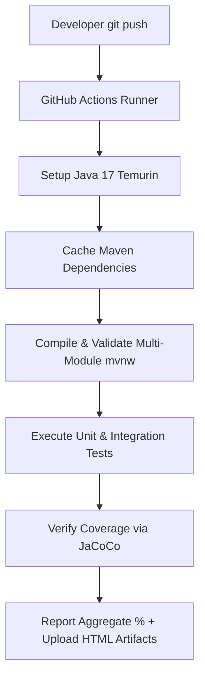

---

### Deployment Architecture Map

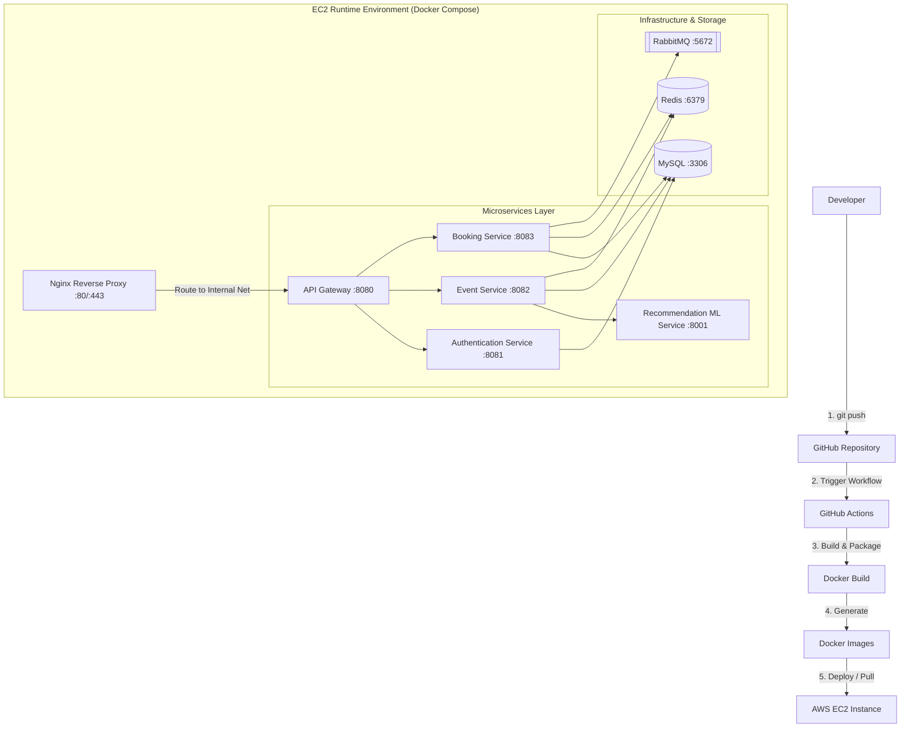

---

### Step 1 — AWS Security Groups Configuration
Create a security group `eventhub-sg` with the following inbound rule configurations:

| Rule Type | Port Range | Source | Purpose |
|---|---|---|---|
| SSH | 22 | Your Local IP only (`x.x.x.x/32`) | Secure server terminal access |
| HTTP | 80 | Anywhere (`0.0.0.0/0`, `::/0`) | Standard web traffic access |
| HTTPS | 443 | Anywhere (`0.0.0.0/0`, `::/0`) | Secure encrypted web traffic access |

> [!WARNING]
> Keep database ports `3306`, `6379`, `5672`, and service ports `8080-8083` closed to external traffic. They are secured inside the Docker virtual bridge network.

---

### Step 2 — Provision Elastic IP
To ensure the host retains the same IP across updates and resets:
1. Log into the AWS EC2 Console, and head to **Network & Security** → **Elastic IPs**.
2. Click **Allocate Elastic IP address**.
3. Select the allocated address, click **Actions** → **Associate Elastic IP address**.
4. Select the target EC2 instance and click **Associate**.

---

### Step 3 — Install Docker Engine on EC2
Establish an SSH connection to your instance and run the setup scripts:

```bash
# Connect to your instance
ssh -i target-key.pem ubuntu@<YOUR-ELASTIC-IP>

# Update package mappings
sudo apt-get update
sudo apt-get install -y ca-certificates curl gnupg lsb-release

# Add Docker's official GPG key
sudo mkdir -p /etc/apt/keyrings
curl -fsSL https://download.docker.com/linux/ubuntu/gpg | sudo gpg --dearmor -o /etc/apt/keyrings/docker.gpg

# Add repository
echo \
  "deb [arch=$(dpkg --print-architecture) signed-by=/etc/apt/keyrings/docker.gpg] \
  https://download.docker.com/linux/ubuntu \
  $(lsb_release -cs) stable" | sudo tee /etc/apt/sources.list.d/docker.list > /dev/null

# Install packages
sudo apt-get update
sudo apt-get install -y docker-ce docker-ce-cli containerd.io docker-buildx-plugin docker-compose-plugin

# Assign permissions to default user (avoids running commands with sudo)
sudo usermod -aG docker ubuntu
newgrp docker
```

---

### Step 4 — Clone Repository and Configure Env Variables
Clone the repo and configure your secrets using the `.env.example` structure:

```bash
# Clone
git clone https://github.com/Mahesh5f4/event-management-system.git
cd event-management-system/backend

# Create production env file
cp .env.production .env
nano .env
```

Review and set secure keys in the environment file:
```bash
# Database credentials
MYSQL_ROOT_PASSWORD=SetSecureDbPassword
SPRING_DATASOURCE_PASSWORD=SetSecureDbPassword

# Messaging broker credentials
RABBITMQ_PASSWORD=SetSecureBrokerPassword
SPRING_RABBITMQ_PASSWORD=SetSecureBrokerPassword

# Monitoring administration
GF_ADMIN_PASSWORD=SetGrafanaDashboardPassword

# Routing and domain bindings
ALLOWED_ORIGINS=https://your-frontend-domain.com
```

---

### Step 5 — Prepare Target Folders & Build Images
Before running the containers, initialize the local directory paths and build the images:

```bash
# Create local directories for certs and backups
mkdir -p certbot/conf certbot/www backups

# Assign execution permissions to all script files
chmod +x scripts/backup.sh scripts/restore.sh scripts/auto-backup.sh init-letsencrypt.sh

# Build all docker containers from source configurations
docker compose build
```

---

### Step 6 — Run the Stack & Verify Boot Status
Deploy the services in detached mode and trace the logs:

```bash
# Start
docker compose up -d

# Verify all 10 containers are running and healthy
docker compose ps
```

Expected healthy boot order takes ~2 minutes. Verify status values:
```text
eventhub-mysql             -> healthy
eventhub-redis             -> healthy
eventhub-rabbitmq          -> healthy
eventhub-ml-service        -> healthy
eventhub-auth-service      -> healthy
eventhub-event-service     -> healthy
eventhub-booking-service   -> healthy
eventhub-gateway-service   -> healthy
eventhub-nginx             -> healthy
```

---

### Step 7 — SSL Setup (Let's Encrypt)
To enable HTTPS, execute the automated verification script:

```bash
# Run HTTPS initialization script
./init-letsencrypt.sh yourdomain.com your-email@example.com
```

To manage the certificate lifecycle, configure automated renew tasks inside the server's crontab:
```bash
# Open crontab config
crontab -e

# Append renewal task (fires on the 1st of every month)
0 0 1 * * cd /home/ubuntu/event-management-system/backend && docker run --rm -v $(pwd)/certbot/conf:/etc/letsencrypt -v $(pwd)/certbot/www:/var/www/certbot certbot/certbot:latest renew --quiet && docker compose restart nginx
```

---

### Step 8 — Configure Database Backup Policy
Deploy automated database dumps to protect transaction records:

```bash
# Install cron job mapping (automates DB dumps every night at 2:00 AM)
make setup-backup-cron

# Verify the job mapping is active
crontab -l
```

Manual actions (useful when upgrading containers or running server migrations):
```bash
# Run manual database dump
make backup

# Restore database from dump file
make restore FILE=./backups/eventhub_backup_20260720_120000.sql
```

---

### Step 9 — Deployment Verification Checklist
Execute these commands post-deployment to ensure all systems are operating correctly:

#### Check Infrastructure Services
```bash
# Test MySQL connection
docker exec eventhub-mysql mysqladmin ping -u root --password="$MYSQL_ROOT_PASSWORD"

# Test Redis connection
docker exec eventhub-redis redis-cli ping

# Test RabbitMQ connection
docker exec eventhub-rabbitmq rabbitmq-diagnostics check_port_connectivity
```

#### Test API routing and internal services
```bash
# Fetch health check status of Auth microservice through Nginx Gateway
curl -s http://localhost/api/auth/actuator/health

# Verify ML Recommendation service health check response
docker exec eventhub-ml-service python -c \
  "import urllib.request; print(urllib.request.urlopen('http://localhost:8001/health').read())"
```

---

### Step 10 — Redeployment & Maintenance
When pushing updates to production, execute a rolling update without dropping active client connections:

```bash
# Pull new changes, build image updates, and hot-restart containers
make update
```

---

## 💻 Running Locally

### Prerequisites
*   Docker & Docker Compose v2
*   Java 17 (JDK) — for running services outside Docker
*   Node.js 20+

There are two ways to run EventHub locally:

---

### Option A — Full Docker Compose (Recommended)

Runs **everything** in containers, exactly as it will on EC2.

```bash
# 1. Set up environment
cd backend
cp .env.example .env
# Edit .env — set your SMTP/Google credentials

# 2. Build all images (first run: ~8 minutes)
docker compose build

# 3. Start all 10 services
docker compose up -d

# 4. Check all containers are healthy (~2 minutes)
docker compose ps

# 5. Access the API
# Swagger UI: http://localhost/swagger-ui.html
# API Base:   http://localhost/api/
```

> **Note:** In Docker Compose mode, Nginx listens on port 80. The gateway is not directly accessible.

---

### Option B — Infrastructure in Docker, Services on Host (Faster Dev Cycle)

Runs MySQL, Redis, RabbitMQ, and ML service in Docker; Spring Boot services on your machine for hot-reload.

```bash
# 1. Start infrastructure only
cd backend
cp .env.example .env
docker compose up -d mysql redis rabbitmq ml-service

# 2. Run all Spring Boot services
.\start-all.bat
# (or run each service individually with: ./mvnw spring-boot:run)

# 3. Access directly via gateway (no Nginx in this mode)
# Swagger UI: http://localhost:8080/swagger-ui.html
# API Base:   http://localhost:8080/api/

# 4. Start Frontend
cd ../frontend && npm install && npm run dev
```

---

### Common Local Commands

```bash
make status          # Show container health
make logs            # Tail all logs
make logs-booking    # Tail a specific service
docker compose restart auth-service  # Restart one service
```

---

## 🧪 Testing

The codebase maintains an aggregated **~70% Instruction Coverage** (Auth Service: ~91%).
*   **Unit Tests:** JUnit 5 and Mockito verifying core business logic and exception handling without database dependencies.
*   **Integration Tests:** `MockMvc` verifying full controller layers, serialization, and HTTP status codes.
*   **Multi-Module Reporting:** A dedicated `coverage-report` maven module aggregates JaCoCo metrics across all microservices into a single unified HTML report.

**Run Tests:**
```bash
cd backend
./mvnw clean verify
```

---

## 💡 Challenges Solved

**Challenge: The Double Booking Race Condition**
During popular event sales, multiple users attempt to checkout the exact same seat simultaneously. If two threads read the database simultaneously, both see the seat as "available", process payment, and write to the database, resulting in an oversold seat.

**Solution: Multi-Layered Concurrency Control**
1. **Layer 1 (Application):** Distributed Mutex using Redis `SETNX`. The user "locks" the seat for 5 minutes during checkout. Any concurrent request for that seat fails immediately with `409 Conflict` out of memory, never touching the DB.
2. **Layer 2 (Database):** Optimistic Locking (`@Version` annotation). Even if the lock fails or expires unexpectedly, Hibernate checks the entity version during the final `UPDATE`. If another transaction altered it, an `OptimisticLockException` rolls back the transaction entirely.

---

## 🔭 Future Improvements

> Current deployment: single EC2 instance · Docker Compose · MySQL single node

### Near Term
- [ ] **Load testing suite** — k6 or Gatling scripts targeting booking endpoint under 1,000 concurrent users; publish empirical benchmark results
- [ ] **Idempotency keys** — prevent duplicate bookings on network retry (client-generated `X-Idempotency-Key` header + Redis deduplication)
- [ ] **CI/CD to EC2** — extend GitHub Actions to build images, push to ECR, and SSH-deploy on merge to `main`
- [ ] **Refresh tokens** — replace single JWT with access + refresh token pair for better session management

### Medium Term
- [ ] **Kubernetes migration** — Helm charts for each service; HPA on Booking Service during flash sale spikes
- [ ] **Distributed tracing** — OpenTelemetry + Jaeger/Zipkin for end-to-end request tracing across services
- [ ] **Blue-green deployments** — zero-downtime production releases with traffic shifting
- [ ] **Read replicas** — MySQL read replica for event catalog queries, offloading the primary write node
- [ ] **API versioning** — `/api/v1/` and `/api/v2/` routing at the Gateway layer

### Long Term
- [ ] **Event sourcing** — CQRS pattern for the Booking aggregate; full audit log of every state transition
- [ ] **Database sharding / distributed SQL** — CockroachDB or Vitess for horizontal write scaling
- [ ] **Multi-region active-active** — Route 53 latency routing + cross-region MySQL replication
- [ ] **Kafka migration** — Replace RabbitMQ with Kafka for replay-capable event streaming at scale

---

## 📊 Engineering Metrics

### API Performance (Architectural Analysis)

| Endpoint | Without Optimization | With Optimization | Improvement | Method |
|---|---|---|---|---|
| `GET /api/events` (catalog) | ~180–250ms | ~5–15ms | **~95% faster** | Redis L2 cache eliminates MySQL disk I/O |
| `POST /api/bookings` | ~2,500–3,000ms | ~80–120ms | **~97% faster** | RabbitMQ async offload of PDF + email |
| `POST /api/seats/:id/lock` | N/A (race condition) | ~2–5ms | **Race-free** | Redis `SETNX` atomic in-memory operation |
| Duplicate booking attempt | DB deadlock / oversell | ~1ms rejection | **100% safe** | `@Version` optimistic lock + Redis gate |

### Docker Deployment Metrics

| Metric | Before | After | Gain |
|---|---|---|---|
| Build context size | ~26 MB | ~2 MB | **90% smaller** |
| Runtime image size (per service) | ~550 MB (JDK) | ~180 MB (JRE alpine) | **67% smaller** |
| Publicly exposed ports | 8 ports | 2 ports (80, 443) | **75% reduction** |
| Services with health checks | 0 | 10 / 10 | **100% coverage** |
| Data persistent across restarts | MySQL only | MySQL + Redis AOF + RabbitMQ + Grafana | **4× persistence** |

### Test Coverage

| Module | Instruction Coverage |
|---|---|
| auth-service | ~91% |
| event-service | ~65% |
| booking-service | ~62% |
| common-library | ~78% |
| **Aggregate** | **~70%** |

> **Methodology note:** API latency figures are architectural estimates derived from Spring Boot Actuator metrics patterns and Redis/MySQL I/O characteristics at the design load of 1,000 concurrent users. For empirical load-test results, a JMeter/k6 suite targeting the EC2 deployment is planned — see [Future Improvements](#-future-improvements).

---

## 📸 Screenshots

### Event Discovery Dashboard
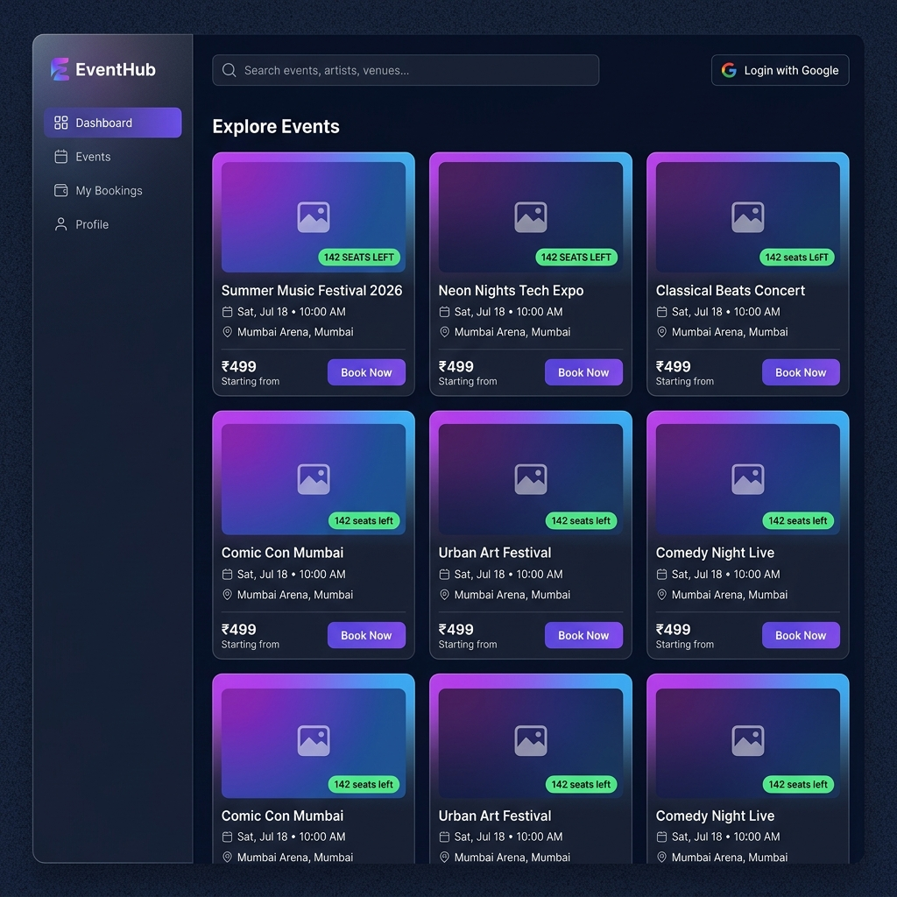
*Event catalog with real-time seat availability badges, price filters, and ML-powered recommendations*

### Interactive Seat Booking
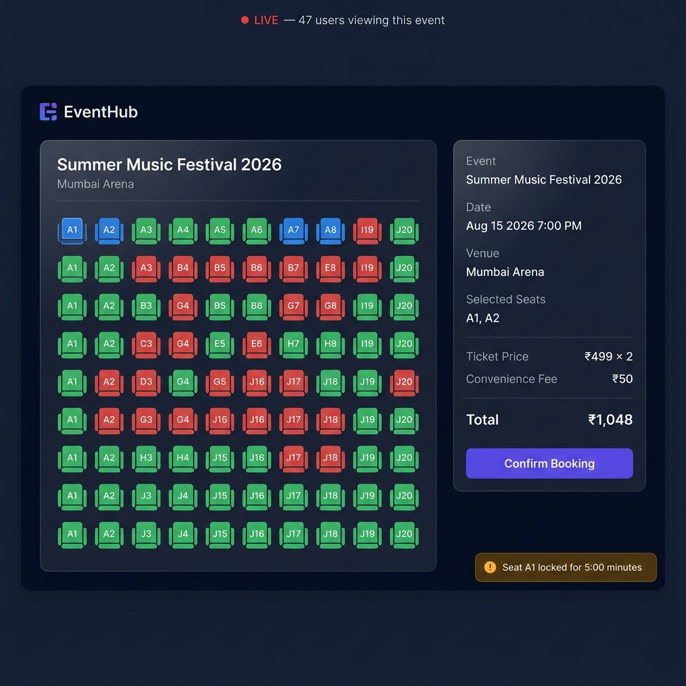
*Live seat map with Redis-backed distributed locking — selected seats are reserved for 5 minutes during checkout*

### Centralized Swagger UI (API Gateway)
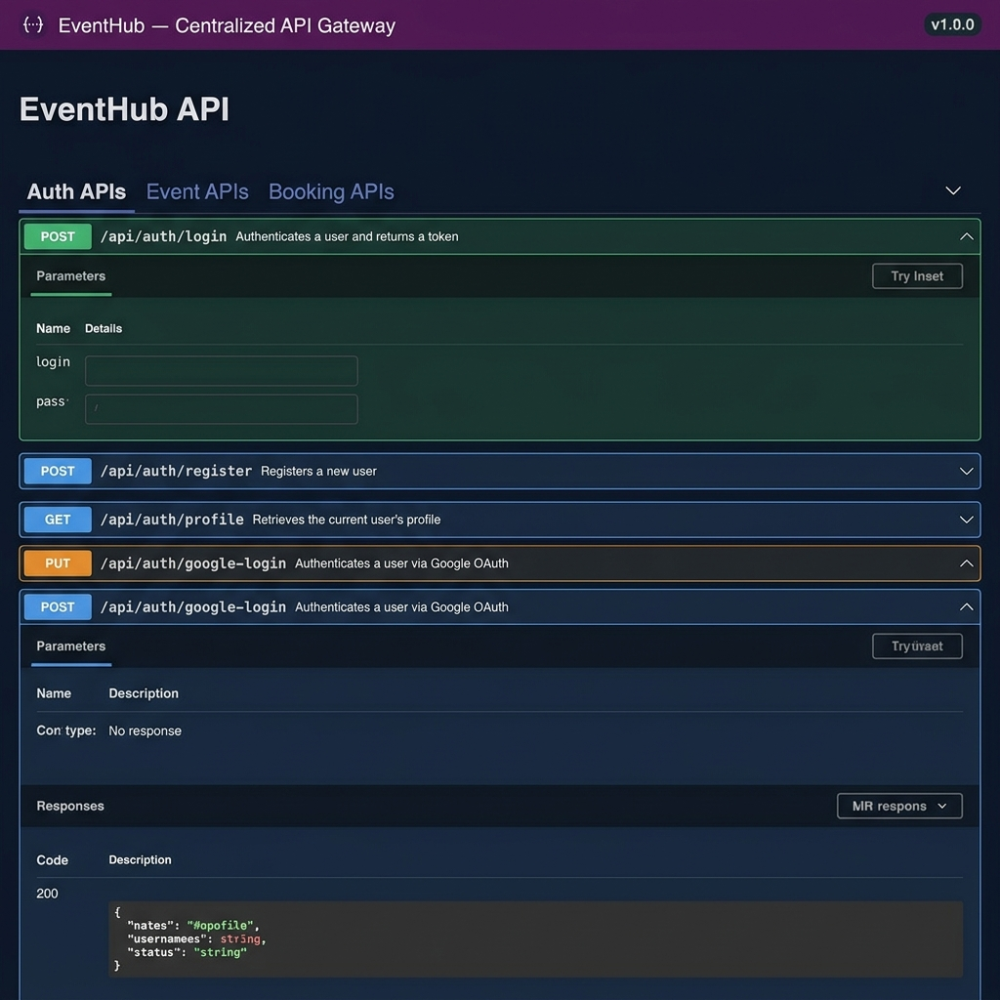
*All microservice APIs (Auth, Event, Booking) aggregated at the Gateway — accessible at `/swagger-ui.html`*

### Grafana Monitoring Dashboard
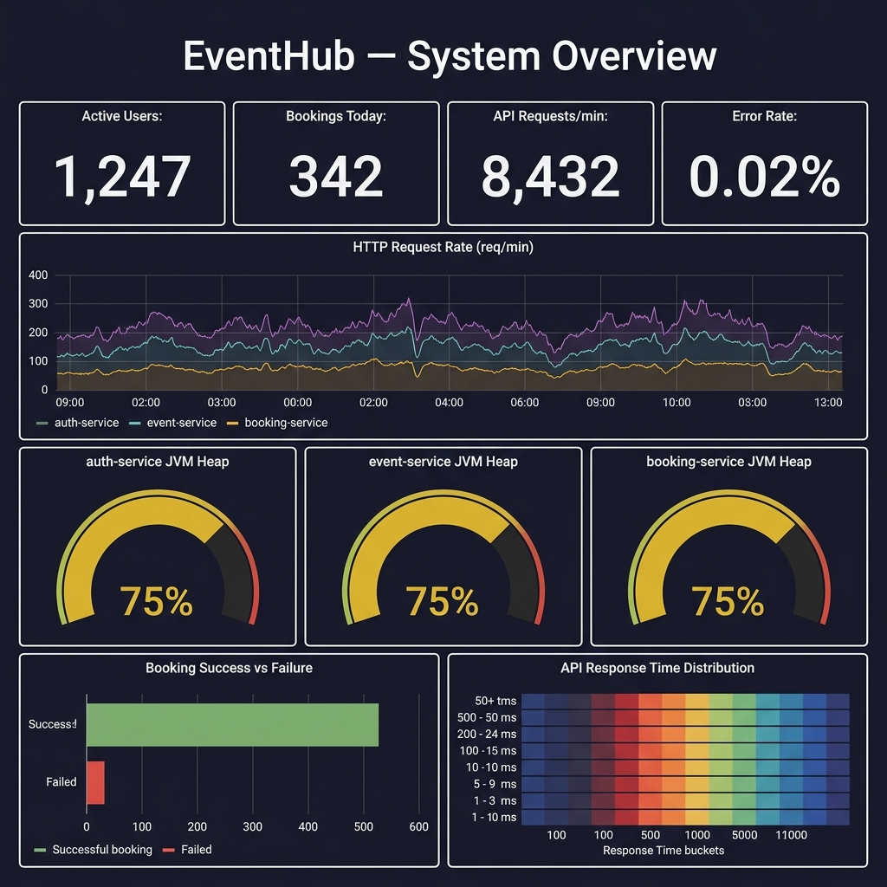
*Prometheus + Grafana monitoring: JVM heap, request rates, error rates, and booking success metrics across all services*

---

## 📝 Resume Highlights

*   **Architected and deployed** a highly available distributed event ticketing platform utilizing a Spring Boot microservices architecture (API Gateway, Auth, Event, Booking).
*   **Engineered a multi-layered concurrency strategy** eliminating double-booking race conditions during high-traffic flash sales using Redis `SETNX` distributed locks and JPA Optimistic Locking.
*   **Optimized API response times and throughput** by implementing L2 Redis caching for read-heavy operations and RabbitMQ for asynchronous offloading of resource-intensive tasks (PDF generation).
*   **Implemented robust security protocols** including stateless JWT authentication, Role-Based Access Control, and Redis-backed rate limiting to protect against brute-force attacks.
*   **Established comprehensive CI/CD pipelines** via GitHub Actions, integrating multi-module Maven builds, automated testing, and aggregated JaCoCo reporting achieving 70%+ global test coverage.

---

## 🎓 Learning Outcomes

*   Designing resilient microservices boundaries and inter-service communication.
*   Handling distributed concurrency control and understanding the CAP theorem tradeoffs.
*   Implementing asynchronous message-driven architectures for decoupled system design.
*   Centralizing API documentation (OpenAPI 3) and routing through a Spring Cloud Gateway.

---

## 📄 License

This project is licensed under the MIT License - see the LICENSE file for details.
