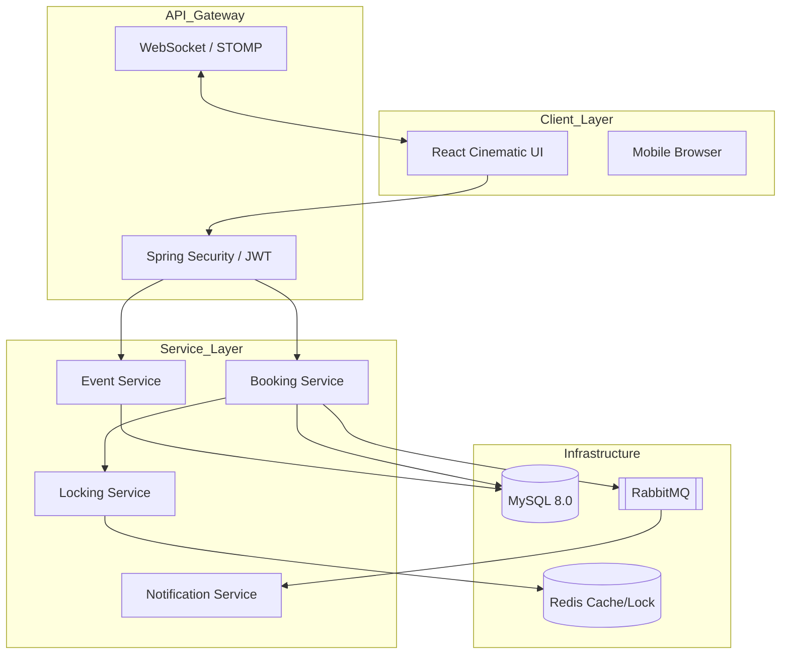

# 🌌 EventHub: Enterprise High-Concurrency Event Ecosystem


## 1. Project Overview
EventHub is a robust, full-stack platform designed to solve the challenges of high-demand event ticketing and real-time seat management. It focuses on **strict transactional consistency**, **distributed concurrency control**, and **cinematic user experiences**.

### Primary Use Cases
- High-traffic "Flash Sale" event ticketing.
- Real-time seat reservation with distributed locking.
- Automated ticket fulfillment and digital asset generation.

### Target Users
- **End Users**: Seeking a seamless, high-performance booking experience.
- **Event Organizers**: Requiring real-time analytics and inventory management.
- **Administrators**: Monitoring system health and managing global configurations.

---

## 2. Features

| Category | Features |
| :--- | :--- |
| **Authentication** | JWT Stateless Auth, Google OAuth 2.0 Integration, OTP-based Verification. |
| **Event Management** | CRUD operations, Soft-deletes, Image Uploads, Scheduled Event Cleanup. |
| **Booking System** | Real-time Seat Claiming, Distributed Redis Mutex, Optimistic Locking. |
| **Admin Features** | Traffic Analytics, Revenue Tracking, Concurrent Request Monitoring. |
| **Scalability** | L2 Caching (Redis), Async Messaging (RabbitMQ), Connection Pooling. |
| **Monitoring** | Spring Actuator Endpoints, Prometheus Integration, Performance Metrics. |
| **Security** | RBAC (Role-Based Access Control), Rate Limiting, Request Correlation Tracing. |

---

## 3. System Architecture

EventHub utilizes a distributed architecture designed for horizontal scalability and fault tolerance.



### Request Flow & Concurrency
1. **Seat Claiming**: When a user selects a seat, a distributed lock is placed in **Redis** using `SETNX` with a 5-minute TTL.
2. **Transactional Booking**: The actual booking occurs within a database transaction, protected by **Optimistic Locking** (`@Version`) to prevent race conditions at the persistence layer.
3. **Async Workflows**: Post-booking tasks (PDF generation, Email) are pushed to **RabbitMQ**, ensuring the main thread returns a response in `<100ms`.

---

## 4. Tech Stack

| Category | Technology |
| :--- | :--- |
| **Frontend** | React 19, TypeScript, Vite, Tailwind CSS, GSAP. |
| **Backend** | Java 17, Spring Boot 3.4, Spring Security, Spring Data JPA. |
| **Database** | MySQL 8.0 (Relational Consistency). |
| **Caching/Locking** | Redis 7.0 (L2 Cache, Distributed Mutex). |
| **Messaging** | RabbitMQ (Asynchronous Task Decoupling). |
| **Monitoring** | Spring Actuator, Prometheus, Micrometer. |
| **Security** | JWT, RSA256 Signatures, Google OAuth 2.0. |

---

## 5. Folder Structure

```text
.
├── backend/                # Spring Boot Maven Project
│   ├── src/main/java/      # Domain-driven packages (auth, booking, events, common)
│   ├── src/main/resources/ # Configuration and static assets
│   ├── monitoring/         # Prometheus/Grafana configurations
│   ├── docker-compose.yml  # Infrastructure orchestration
│   └── pom.xml             # Dependency management
├── frontend/               # Vite React Project
│   ├── src/components/     # Atomic UI components and Hero section
│   ├── src/store/          # Redux Toolkit slices and hooks
│   ├── src/pages/          # Routing entry points
│   ├── tailwind.config.js  # JIT-enabled styling configuration
│   └── tsconfig.json       # Type-safety configurations
└── README.md               # Master Documentation
```

---

## 6. Database Design

### Core Entities
- **User**: Stores identity, RBAC roles, and activity tracking.
- **Event**: Core inventory entity with `totalSeats`, `availableSeats`, and `@Version` for concurrency.
- **Booking**: Junction entity with historical snapshots of event data to ensure audit integrity.

### Seat Locking Flow
1. **Request**: User clicks a seat.
2. **Lock**: `Redis.setIfAbsent("seat_lock:" + eventId + ":" + seatId, userId, 5m)`.
3. **Validate**: If `true`, proceed to checkout; if `false`, seat is already held.
4. **Finalize**: On successful booking, the Redis lock is released and the MySQL `available_seats` is decremented.

---

## 7. API Documentation

| Method | Endpoint | Purpose |
| :--- | :--- | :--- |
| `POST` | `/auth/login` | Authenticates user and returns JWT. |
| `GET` | `/events?page=0` | Fetches paginated list of active events. |
| `POST` | `/bookings` | Atomic booking request with seat validation. |
| `GET` | `/admin/analytics/traffic` | Returns real-time traffic and revenue data. |

### Request Example (`POST /bookings`)
```json
{
  "eventId": 101,
  "seatId": "A12",
  "ticketCount": 1
}
```

---

## 8. Authentication & Security
- **JWT Flow**: Claims-based tokens signed with RSA256. Tokens are validated via a custom `OncePerRequestFilter`.
- **OAuth Integration**: Seamless login via Google, mapping external profiles to internal `User` entities.
- **Role-Based Access**: Method-level security using `@PreAuthorize("hasRole('ADMIN')")`.

---

## 9. Scalability & Performance
- **Optimistic Locking**: Prevents "double-booking" without the performance penalty of database row-locking.
- **Redis L2 Caching**: Frequently accessed event data is cached with a 10-minute TTL to reduce DB read pressure.
- **RabbitMQ Workers**: Decouples CPU-intensive PDF generation from the API request cycle.

---

## 10. Local Development Setup

### Infrastructure (Docker)
```bash
cd backend
docker-compose up -d
```

### Backend
1. Configure `application.yml` with your DB/Redis/Rabbit credentials.
2. Run: `./mvnw spring-boot:run`

### Frontend
1. `cd frontend`
2. `npm install`
3. `npm run dev`

---

## 11. Deployment
- **Frontend**: Optimized static build served via Nginx or Vercel.
- **Backend**: Containerized Spring Boot JAR deployed on AWS ECS or Kubernetes.
- **Database**: Managed RDS (MySQL) with read-replicas for scaling.

---

## 12. Screenshots / GIFs

*Caption: Cinematic GSAP-powered Hero section with mouse parallax.*


*Caption: Real-time traffic and revenue monitoring for administrators.*

---

## 13. Future Improvements
- **Idempotency Keys**: Implementing keys for all write operations to prevent duplicate bookings during network retries.
- **GraphQL Integration**: Reducing over-fetching for complex event/user relationship queries.
- **Auto-Scaling**: Kubernetes Horizontal Pod Autoscaler (HPA) based on custom Prometheus metrics.

---

## 14. Contributing
1. Fork the repository.
2. Create your feature branch (`git checkout -b feature/AmazingFeature`).
3. Commit your changes (`git commit -m 'Add some AmazingFeature'`).
4. Push to the branch (`git push origin feature/AmazingFeature`).
5. Open a Pull Request.

---

## 15. README STYLE RULES
- **Tone**: Rigorous, technical, and objective.
- **Formatting**: Heavy use of tables and Mermaid diagrams for quick parsing.
- **AI-Ready**: Structured with clear headings and property keys for easy LLM context ingestion.
